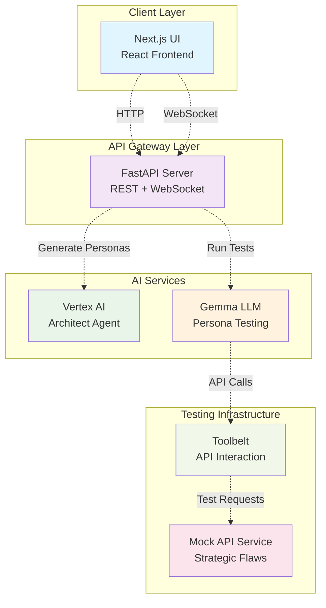
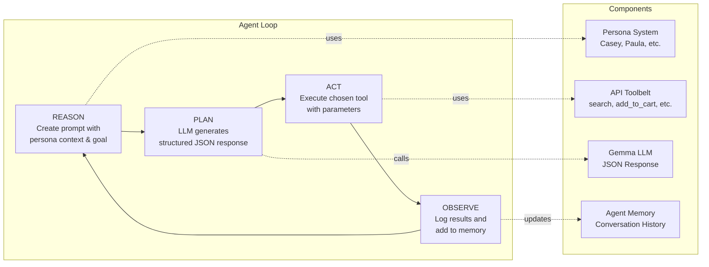
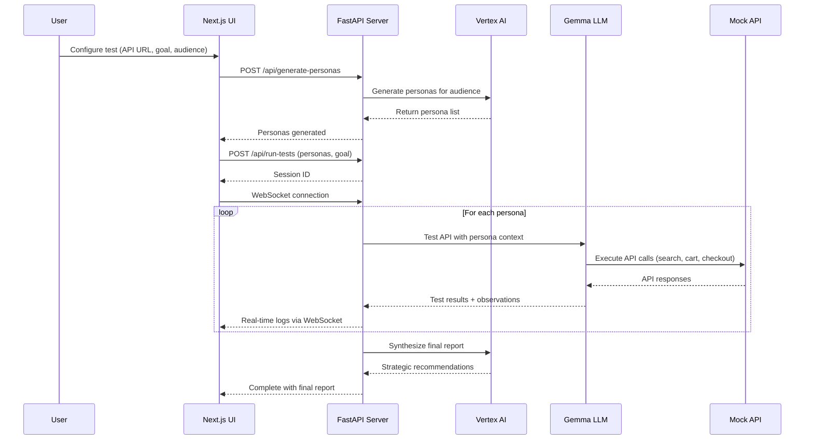
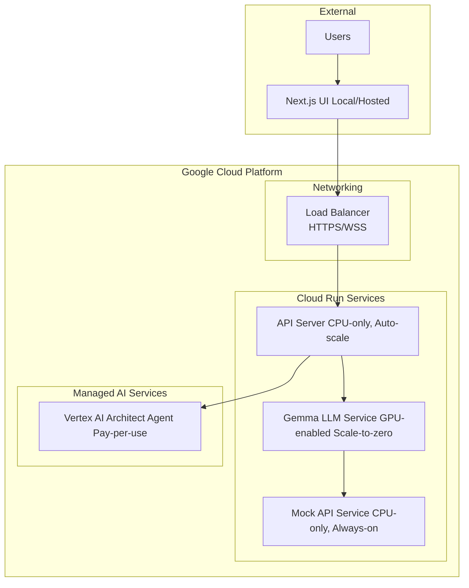
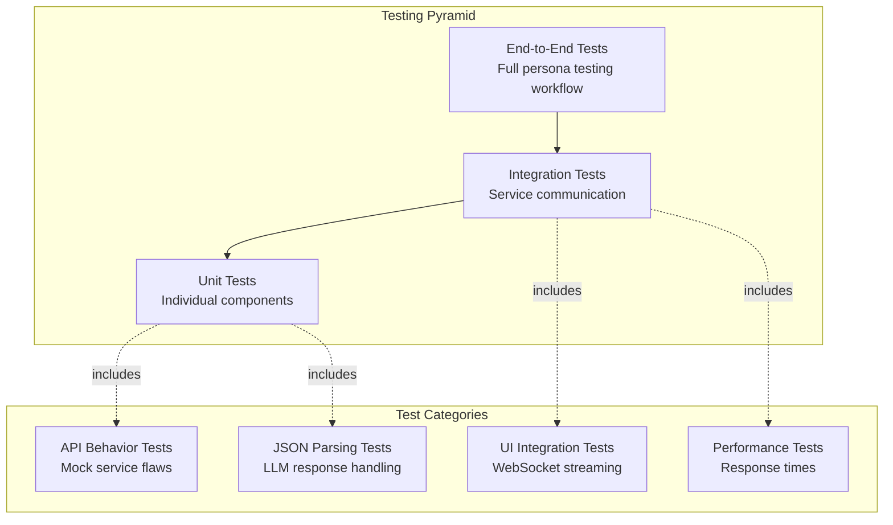

# PersonaFlow - AI-Powered API Testing with Personas

**PersonaFlow transforms the slow, expensive process of user feedback into an automated, continuous intelligence pipeline.**

For agile product teams, understanding user experience across different customer segments is critical but traditionally requires weeks of user research, surveys, and testing sessions. PersonaFlow eliminates this bottleneck by providing **immediate, persona-driven UX feedback directly within the development lifecycle**.

### The Vision: UX Expert in Your CI/CD Pipeline

Imagine integrating a team of UX experts directly into your deployment process. With every significant release, PersonaFlow automatically deploys AI agents—each embodying key user personas—against your application. Within minutes, you receive detailed reports: *"Casual Casey got confused by the new checkout flow due to case-sensitive search"* or *"Power-User Paula discovered a potential data leak in the admin endpoints."*

This isn't just automated testing—it's **automated user empathy at scale**.

### Immediate ROI for Product Teams

- **10x faster feedback cycles**: From weeks of user research to minutes of automated testing
- **Comprehensive coverage**: Test against multiple personas simultaneously 
- **Actionable insights**: Specific, prioritized recommendations for each user segment
- **Continuous validation**: Integrate directly into CI/CD for every deployment
- **Cost efficiency**: Replace expensive user testing sessions with automated persona agents

## Demo 
[Demo video](https://www.dropbox.com/scl/fi/9fmwzyjm7qhnnqqco4mup/screen_recording_persona_flow.mov?rlkey=ivhoj7pok4f25399k37tjsfaf&st=i1cz2i30&dl=0)

## Architecture Overview

PersonaFlow follows a microservices architecture with five main components working together to provide end-to-end AI-powered API testing.



## Agent Loop Architecture

The core testing follows a structured **REASON → PLAN → ACT → OBSERVE** loop:



## Service Architecture

### Core Services

| Service | Technology | Purpose | Deployment |
|---------|------------|---------|------------|
| **UI** | Next.js/React | User interface and real-time monitoring | Local (Deployment in progress)|
| **API Server** | FastAPI + WebSockets | Orchestrates testing, handles real-time logs | Google Cloud Run |
| **Mock API** | FastAPI | Target API with strategic flaws for testing | Google Cloud Run |
| **Vertex AI** | Google Cloud | Architect agent for dynamic persona generation | Managed Service |
| **Gemma LLM** | Vertex AI Model | Persona-based API testing agent | Google Cloud Run + GPU |



## Test-Driven Development (TDD) Strategy

PersonaFlow was built using a comprehensive TDD approach across all components:

### 1. Mock API Service - Strategic Flaw Testing

**Test Coverage: 18 comprehensive tests**

```python
# Example: Testing strategic case-sensitivity flaw
def test_search_case_sensitivity():
    """Verify search is case-sensitive (intentional flaw for Casual Casey)"""
    response = client.get("/search?q=wireless mouse")  # lowercase
    assert response.status_code == 200
    assert response.json()["total"] == 0  # No results
    
    response = client.get("/search?q=Wireless Mouse")  # proper case
    assert response.status_code == 200
    assert response.json()["total"] > 0  # Has results
```

**Strategic Flaws by Design:**
- **Case-sensitive search**: Frustrates casual users 
- **Inconsistent cart responses**: Confuses developers 
- **Artificially slow endpoints**: Tests patience 
- **Hidden required fields**: Blocks completion 
- **Security information leakage**: Discovered by security-minded users

### 2. JSON Parsing - LLM Response Handling

**Test Coverage: Comprehensive edge case testing**

```python
def test_json_parsing_with_markdown_blocks():
    gemma_response = '''```json
    {"thought": "I need to search for products", "tool_name": "search_products"}'''
    
    result = clean_json_response(gemma_response)
    parsed = json.loads(result)
    assert parsed["tool_name"] == "search_products"
```
### 3. UI Integration - Real-time Testing

**End-to-end integration tests** covering:
- Persona generation via Vertex AI
- Real-time WebSocket log streaming
- Markdown report rendering
- Error handling and recovery

## Deployment Architecture

### Google Cloud Services


## Persona System

### Dynamic Persona Generation

The **Architect Agent** (Vertex AI) can generate custom personas based on target audience:

```python
# Example: Generate personas for "university students on tight budgets"
architect = Architect()
personas = architect.generate_personas(
    market_segment="university students on tight budgets",
    num_personas=3
)
# Returns: Budget-focused, Tech-savvy Student, Time-pressed Researcher
```

## Technical Implementation

### Agent Loop Implementation

```python
class Agent:
    def __init__(self, persona: Persona, toolbelt: Toolbelt, llm_client: LLMServiceClient):
        self.persona = persona
        self.toolbelt = toolbelt
        self.llm_client = llm_client
        self.memory = []  # Conversation history
    
    def run_test(self, goal: str, max_steps: int = 8):
        for step in range(max_steps):
            # REASON: Create prompt with context
            prompt = self._create_prompt(goal)
            
            # PLAN: Get LLM response
            llm_output = self.llm_client.invoke(prompt)
            response = LLMResponse.model_validate_json(llm_output)
            
            # ACT: Execute tool
            result = self.toolbelt.use_tool(response.tool_name, response.parameters)
            
            # OBSERVE: Update memory
            self.memory.append({"role": "assistant", "content": response.model_dump_json()})
            self.memory.append({"role": "tool_observation", "content": result})
            
            # Check completion
            if self._is_goal_achieved(result):
                break
```

### Real-time Logging System

```python
# WebSocket-based real-time logging
@app.websocket("/api/test-sessions/{session_id}/logs")
async def websocket_logs(websocket: WebSocket, session_id: str):
    await manager.connect(websocket, session_id)
    
    async def broadcast_log(session_id: str, type: str, message: str):
        log = LogMessage(
            timestamp=datetime.now().isoformat(),
            session_id=session_id,
            type=type,  # "thinking", "acting", "observing", "error"
            message=message
        )
        await manager.send_log(session_id, log)
```

### UI State Management

```typescript
// Real-time log streaming with auto-scroll
const connectWebSocket = (sessionId: string) => {
  const ws = new WebSocket(`ws://localhost:8000/api/test-sessions/${sessionId}/logs`)
  
  ws.onmessage = (event) => {
    const logMessage: LogMessage = JSON.parse(event.data)
    setLogs(prev => [...prev, logMessage])
    
    // Auto-scroll to bottom
    setTimeout(() => {
      if (logContainerRef.current) {
        logContainerRef.current.scrollTop = logContainerRef.current.scrollHeight
      }
    }, 100)
  }
}
```

## 📊 Testing Strategy & Coverage

### Test Pyramid



### Test Execution

```bash
# Mock API Service Tests (18 tests)
cd mock-api-service
uv run pytest tests/ -v

# Agent Service Tests
cd agent-runner-service  
uv run pytest tests/ -v

# JSON Parsing Tests
uv run pytest tests/test_json_parsing.py -v

# End-to-End Integration
uv run python run_end_to_end_demo.py
```

## Strategic Design Philosophy

PersonaFlow is designed around the principle of **Strategic Failure Discovery**:

1. **Intentional Flaws**: The mock API contains carefully designed issues that real APIs commonly have
2. **Persona-Driven Discovery**: Different personas naturally discover different types of issues
3. **Realistic Testing**: Personas behave like real users, not perfect test scripts
4. **Actionable Insights**: Final reports provide specific, prioritized recommendations

### Flaw Discovery Matrix (Example)

| API Issue | Casual Casey | Power-User Paula | Budget Ben | Impatient Ian |
|-----------|--------------|------------------|------------|---------------|
| Case-sensitive search | ✅ Frustrated | ⚠️ Notices | ➖ Neutral | ➖ Neutral |
| Inconsistent responses | ➖ Confused | ✅ Analyzes | ➖ Neutral | ➖ Neutral |
| Hidden fees | ➖ Surprised | ➖ Notices | ✅ Outraged | ➖ Neutral |
| Slow endpoints | ➖ Patient | ⚠️ Measures | ➖ Waits | ✅ Abandons |
| Security leaks | ➖ Ignores | ✅ Reports | ➖ Neutral | ➖ Neutral |

## Development Workflow

### Local Development

```bash
# 1. Start Mock API
cd mock-api-service
uv sync && uv run python server.py

# 2. Start Agent Service  
cd agent-runner-service
uv sync && uv run python api_server.py

# 3. Start UI
cd ui
npm install && npm run dev

# 4. Run Tests
uv run pytest -v  # All services
```
